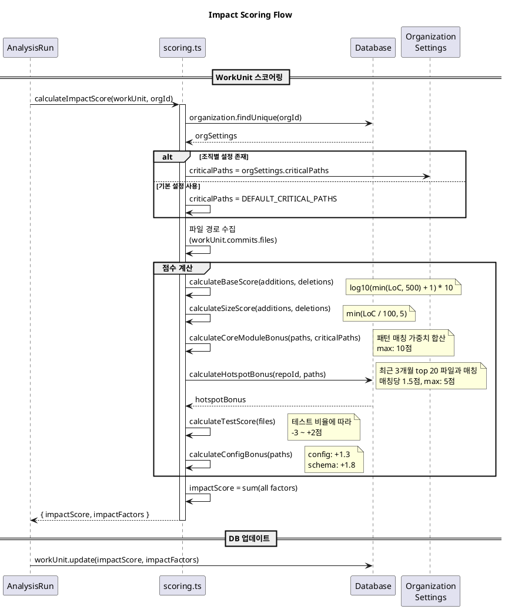
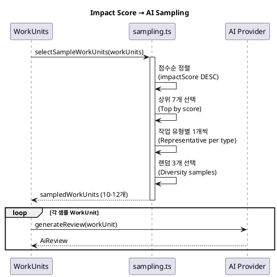

# 임팩트 스코어링 (Impact Scoring)

WorkUnit의 영향력을 다양한 요소를 고려하여 점수화하는 시스템입니다.

---

## 개요

### 목적

임팩트 스코어링은 개발자가 수행한 작업(WorkUnit)의 **영향력**을 정량화합니다.

- **AI 샘플링 최적화**: 높은 점수의 WorkUnit을 우선적으로 LLM 분석에 사용
- **개발 기여도 평가**: 코드 변경량뿐 아니라 핵심 모듈, 테스트 등 품질 요소 반영
- **연간 리포트 지표**: 개발자별 영향력 분포를 시각화

### 전체 파이프라인에서의 위치

```
Commit 수집 → WorkUnit 클러스터링 → [임팩트 스코어링] → AI 샘플링 → 리포트 생성
```

---

## 스코어 계산 공식

```
impactScore = baseScore + sizeScore + coreModuleBonus + hotspotBonus + testScore + configBonus
```

### 요소별 상세

| 요소 | 계산 방식 | 최대값 | 설명 |
|------|----------|--------|------|
| baseScore | `log10(LoC + 1) * 10` | ~27점 | 로그 스케일로 변경량 반영 |
| sizeScore | `min(LoC / 100, 5)` | 5점 | 선형 규모 보너스 |
| coreModuleBonus | 핵심 경로 가중치 합산 | 10점 | 중요 모듈 변경 시 가산 |
| hotspotBonus | 핫스팟 매칭 × 1.5 | 5점 | 자주 변경되는 파일 |
| testScore | 테스트 비율 기반 | -3 ~ +2점 | 적절한 테스트 포함 여부 |
| configBonus | 설정/스키마 변경 | ~3.1점 | 인프라 변경 보너스 |

> **LoC (Lines of Code)**: `additions + deletions`, 최대 500줄로 제한

---

## 시퀀스 다이어그램

### 스코어링 전체 흐름



### AI 샘플링 연계



---

## 각 요소 상세 설명

### 1. baseScore (기본 점수)

**로그 스케일**을 사용하여 대규모 변경이 점수를 과도하게 지배하지 않도록 합니다.

```typescript
cappedLoc = min(additions + deletions, 500)
baseScore = log10(cappedLoc + 1) * 10
```

| LoC | 점수 |
|-----|------|
| 10줄 | ~10점 |
| 100줄 | ~20점 |
| 500줄 | ~27점 |

### 2. sizeScore (규모 점수)

**선형 보너스**로 baseScore와 다른 관점에서 규모를 평가합니다.

```typescript
sizeScore = min(cappedLoc / 100, 5)
```

### 3. coreModuleBonus (핵심 모듈 보너스)

비즈니스 로직, API, 데이터베이스 등 **핵심 경로**를 변경할 때 가산됩니다.

**기본 핵심 경로:**

| 패턴 | 가중치 | 설명 |
|------|--------|------|
| `src/core/` | 2.0 | 핵심 비즈니스 로직 |
| `prisma/` | 1.8 | 데이터베이스 스키마 |
| `src/lib/` | 1.5 | 공통 라이브러리 |
| `src/api/` | 1.5 | API 엔드포인트 |
| `src/components/ui/` | 1.0 | UI 컴포넌트 |

> 조직별로 커스텀 설정 가능 (`organization.settings.criticalPaths`)

### 4. hotspotBonus (핫스팟 보너스)

**최근 3개월**간 가장 많이 변경된 파일(상위 20개)과 겹치는 경우 가산됩니다.

```typescript
hotspotBonus = min(matchCount * 1.5, 5)
```

자주 변경되는 파일은 중요도가 높을 가능성이 큽니다.

### 5. testScore (테스트 점수)

테스트 포함 비율에 따라 **가점 또는 감점**됩니다.

| 테스트 비율 | 점수 | 이유 |
|------------|------|------|
| > 80% | -3점 | 테스트만 과다 (코드 변경 없음) |
| 50-80% | +1점 | 균형 있는 테스트 |
| 0-50% | +2점 | 적절한 테스트 포함 |
| 0% | 0점 | 테스트 없음 |

**테스트 파일 패턴:**
- `__tests__/`, `.test.`, `.spec.`
- `test/`, `tests/`, `cypress/`, `e2e/`

### 6. configBonus (설정/스키마 보너스)

인프라 및 설정 파일 변경 시 가산됩니다.

| 유형 | 보너스 | 패턴 |
|------|--------|------|
| Config | +1.3 | `package.json`, `tsconfig.json`, `.eslintrc`, `next.config`, `Dockerfile` 등 |
| Schema | +1.8 | `prisma/schema.prisma`, `schema.sql`, `migrations/` 등 |

---

## 점수 분포 분석

`analyzeScoreDistribution()` 함수로 전체 점수 분포를 분석할 수 있습니다.

### 분포 지표

```typescript
interface ScoreDistribution {
  min: number;
  max: number;
  avg: number;
  median: number;
  percentiles: {
    p25: number;
    p50: number;
    p75: number;
    p90: number;
  };
  buckets: Array<{ range: string; count: number }>;
}
```

### 버킷 분포

| 범위 | 일반적인 케이스 |
|------|----------------|
| 0-5 | 소규모 수정, 단일 파일 변경 |
| 5-10 | 일반적인 기능 추가 |
| 10-15 | 핵심 모듈 포함 작업 |
| 15-20 | 대규모 기능, 여러 핵심 모듈 |
| 20-25 | 주요 리팩토링, 아키텍처 변경 |
| 25+ | 대규모 변경 + 핵심 모듈 + 테스트 |

---

## 조직별 커스터마이징

### 설정 방법

`Organization.settings`에 `criticalPaths`를 지정합니다:

```json
{
  "criticalPaths": [
    { "pattern": "src/services/", "weight": 2.5, "label": "비즈니스 서비스" },
    { "pattern": "src/utils/", "weight": 1.0, "label": "유틸리티" }
  ]
}
```

### 적용 우선순위

1. 조직별 `criticalPaths` 설정이 있으면 해당 값 사용
2. 없으면 `DEFAULT_CRITICAL_PATHS` 사용

---

## 관련 소스 코드

| 파일 | 설명 |
|------|------|
| `src/lib/analysis/scoring.ts` | 스코어링 핵심 구현 |
| `src/lib/ai/sampling.ts` | AI 샘플링 (점수 기반 선택) |
| `src/types/index.ts` | `ImpactFactors` 타입 정의 |

---

## 참고

- [ARCHITECTURE.md](./ARCHITECTURE.md) - 전체 시스템 아키텍처
- [journal-ai-analysis.md](./journal-ai-analysis.md) - AI 분석 상세
